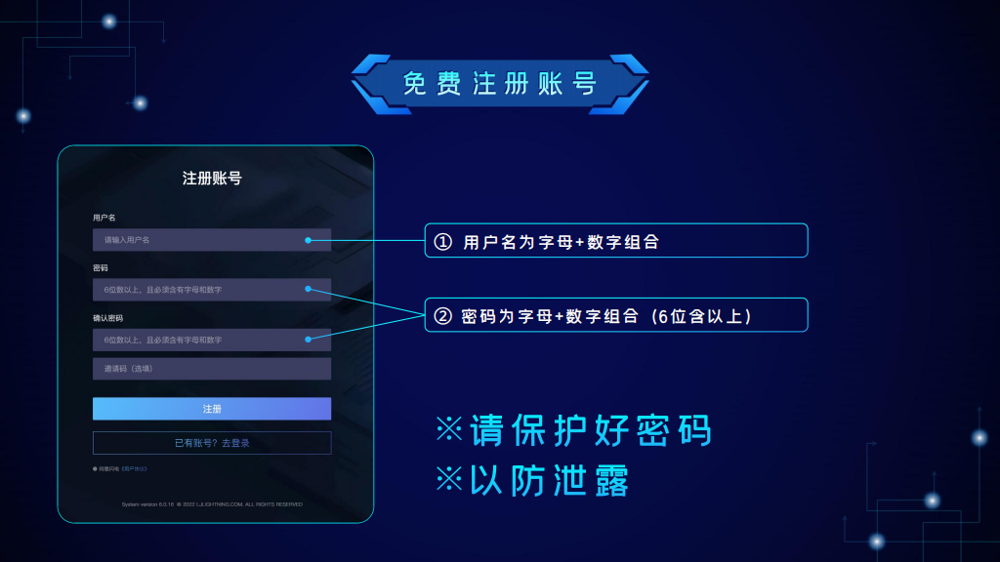
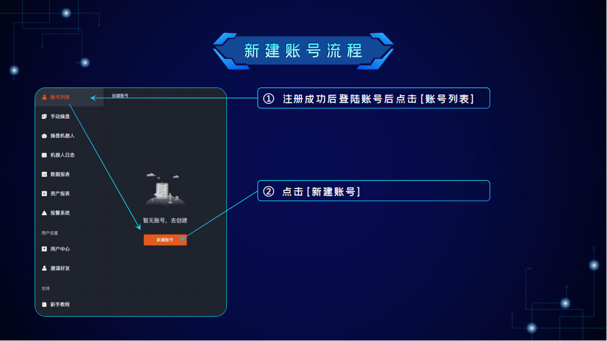

# 新手引导

## 1.介绍 

<figure><figcaption></figcaption></figure>

闪电官方网站：[https://www.llkkz.net](https://www.llkkz.net)

闪电6.0

稳定运行6年

最安全的交易机器人

现已支持各大Dex

## 2.免费注册账号注册 

<figure><figcaption></figcaption></figure>

①用户名为字母+数字组合

②密码为字母+数字组合（6位含以上）

## 3.新建账号流程 

<figure><figcaption></figcaption></figure>

①注册成功后登陆账号后点击【账号列表】

②点击【新建账号】\
