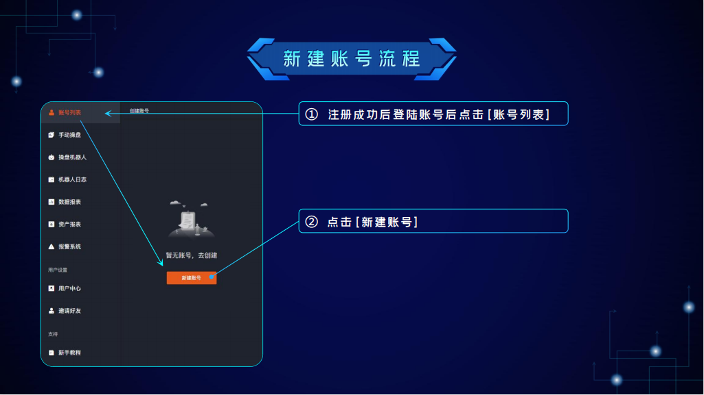

# Tutorial

## 1.Introduce 

<figure><figcaption></figcaption></figure>

Official website：[https://www.llkkz.net](https://www.llkkz.net)



## 2.Register 

<figure><figcaption></figcaption></figure>

① Enter letters + numbers in the username

② The password must contain a combination of letters and numbers (6 characters or more)

## 3.Create Account 

<figure><figcaption></figcaption></figure>

① After the registration is successful, log in to your account and click \[Account List]

② Click \[New Account]\
